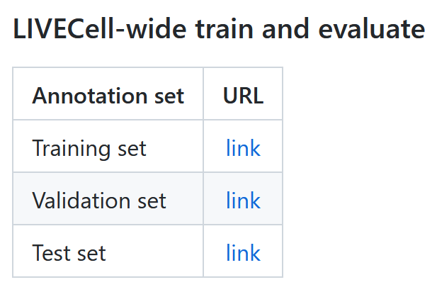
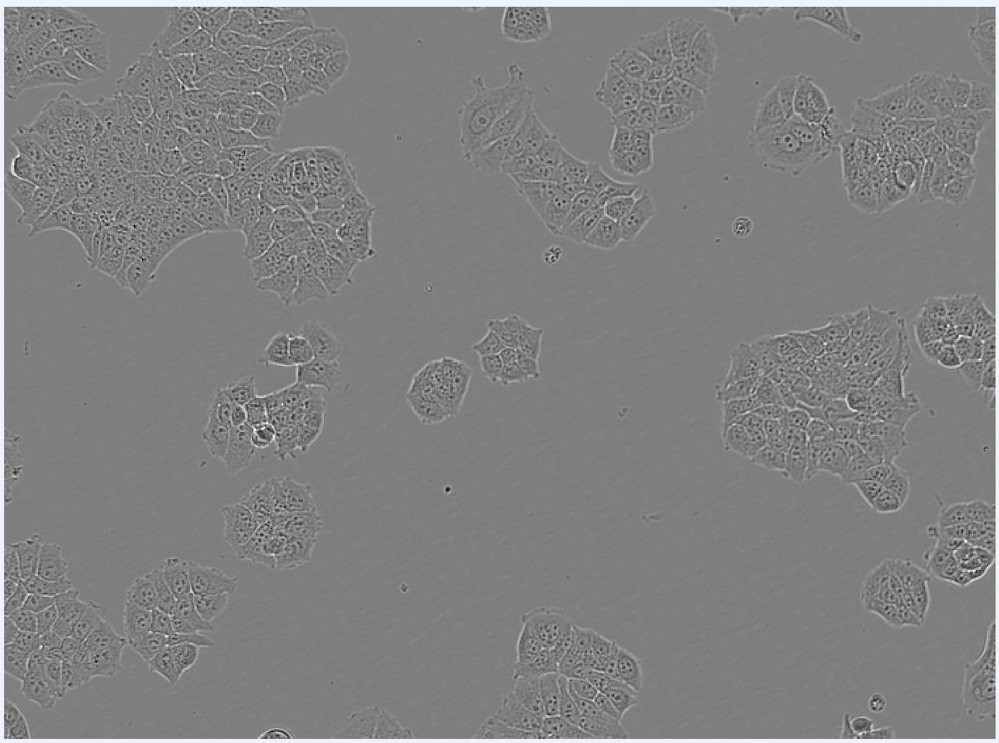

# Setup
Halte dich einfach an die unten stehenden Punkte, um alles einzurichten. Keine Sorge, du erfährst später noch genauer was alles bedeutet.

1. Projektordner anlegen mit folgender Struktur (**alle Pfade dürfen keine Leerzeichen enthalten**)<br>
    - Ein Unterordner "Data"<br>
    - Ein Unterordner "Src" (Abkürzung für Source)
1. Datensatz herunterladen und als Unterordner in Data speichern
    - [Bilddaten](http://livecell-dataset.s3.eu-central-1.amazonaws.com/LIVECell_dataset_2021/images.zip)
    - [Annotationen](https://github.com/sartorius-research/LIVECell), runterscrollen bis hier: <br>
    Jeweils rechtsklick auf link und dann "Ziel Speichern unter"
1. Python installieren
    - Miniconda [hier](https://conda.io/projects/conda/en/stable/user-guide/install/windows.html) herunterladen und bei der Installation "Nur für Mich" und "zu PATH hinzufügen" auswählen
    - Eine neue Umgebung erstellen
        - Ein Terminal öffnen (unter Windows nach cmd suchen)
        Falls bei ```conda -version``` der Befehl nicht gefunden werden kann, ist ein neustart nötig
        - ```bash
    	    conda create --name py4scy python=3.9
            conda activate py4scy
            pip install numpy jupyter
        ``
1. [Visual Studio Code installieren](https://code.visualstudio.com/docs/?dv=win)
    - Extensions installieren, wie das geht steht [hier](https://code.visualstudio.com/docs/editor/extension-marketplace)
        - Wir brauchen "Python" und "Jupyter"

# Unser Projekt
Der Datensatz, den du heruntergeladen hast, ist der _“Livecell Datensatz”_. Hierbei handelt es sich um Lichtmikroskop Bilder von Zellen. Was genau der Datensatz enthält, werden wir uns später noch genauer ansehen. Es gibt auch ein zugehöriges Paper in [“Nature Methods”](https://www.nature.com/articles/s41592-021-01249-6).

Im Laufe dieses Kurses wollen wir versuchen, die einzelnen Zellen auf den Bildern des Datensatzes automatisiert zu zählen. Dafür beginnen wir zunächst mit simplen Methoden und arbeiten uns dann zu komplexeren Methoden hoch. Da du in diesem Kurs mehr als nur Zellen zählen lernen sollst, weichen wir aber an einigen Stellen von unserem Hauptziel ab und erforschen andere Seiten des Datensatzes, um dir alle Seiten der Pythonprogrammierung näher zu bringen.
